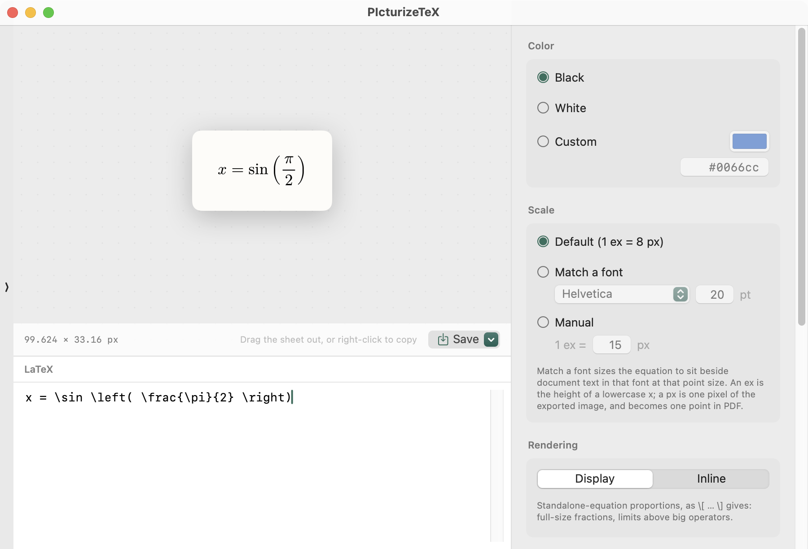

# PIcturizeTeX

A native Mac app that turns LaTeX equations into pictures — SVG, PDF, and PNG — with
every feature of [viereck.ch/latex-to-svg](https://viereck.ch/latex-to-svg/), plus the
things a web page can't do. Equations are rendered by a bundled MathJax 4, entirely
offline.



## Install

Download the latest `PIcturizeTeX-x.y.z.zip` from
[Releases](../../releases), unzip it, and drag `PIcturizeTeX.app` into
`/Applications`.

**First launch:** this build is not notarized (no Apple Developer account), so
macOS will refuse to open it at first. Open **System Settings → Privacy &
Security**, scroll down to the message about PIcturizeTeX, and click **Open
Anyway** — needed only once. If you would rather not trust a downloaded
binary, build it from source below; it takes about a minute.

Requires macOS 14 or later on Apple Silicon. Intel Macs: build from source.

## Build and run

Requires only the Xcode Command Line Tools (no Xcode):

```sh
./Scripts/bundle.sh            # builds and assembles build/PIcturizeTeX.app
open build/PIcturizeTeX.app
```

Release build: `./Scripts/bundle.sh release`. Tests: `swift test`.
Release zip: `./Scripts/release.sh <version>`.

## What it does

- **Live preview** as you type, shown at the equation's true export size; errors are
  reported without blanking the last good render.
- **Right-click the preview to Copy** (or ⇧⌘C): PDF + PNG + SVG go on the clipboard as
  one item — Keynote takes the PDF, Figma the SVG, Slack the PNG.
- **Drag the equation out** into any app or Finder to drop a file (format
  configurable, default PDF).
- **Save** as SVG (⌘S), PDF (⌘D), or PNG (⌘E); remembers the last folder.
- **Color**: black / white / custom, chosen with a native color well (CSS text as a
  secondary input). The preview background darkens automatically for light colors.
- **Scaling**: default (1 ex = 8 px), match a CSS font, or manual px-per-ex.
- **Display mode** toggle; transparent-background PNG at 96–600 dpi.
- **History**: equations you've exported, shown as rendered thumbnails, restorable
  with their settings. Toggled from the toolbar; open/closed state persists across
  launches.
- **Macro preamble**: a persistent `\newcommand` block applied to every render.
- **Menu bar companion** (the π in your menu bar): a compact editor with live
  preview, color and scale pickers, drag-out, right-click copy, and save — always
  in display mode, and fully functional with the main window closed.

## Layout

| Path | Role |
|---|---|
| `Sources/LatexCore` | Pure logic: settings, SVG post-processing, history/preamble stores. All unit tests target this. |
| `Sources/LatexRender` | The MathJax engine (offscreen `WKWebView`) and the SVG→PDF→PNG export pipeline. `Resources/render.html` is the entire JS surface. |
| `Sources/LatexToSVG` | The SwiftUI app. |
| `Scripts/bundle.sh` | Assembles the `.app` from SwiftPM output (SwiftPM alone emits a bare executable, and WebKit requires a signed bundle). |

Data lives in `~/Library/Application Support/PIcturizeTeX/` (`history.json`,
`preamble.tex`) — both plain text.

## Updating MathJax

Replace `Sources/LatexRender/Resources/mathjax/tex-svg.js` with a newer
`mathjax@N/tex-svg.js` from npm and rebuild. It's a single self-contained file.

## License

MIT — see [LICENSE](LICENSE). Equations are typeset by
[MathJax](https://www.mathjax.org), which is bundled under the Apache License
2.0 (`Sources/LatexRender/Resources/mathjax/LICENSE`).
